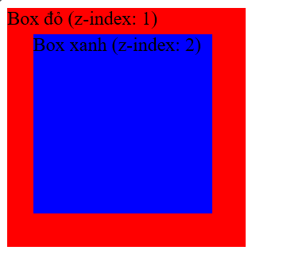
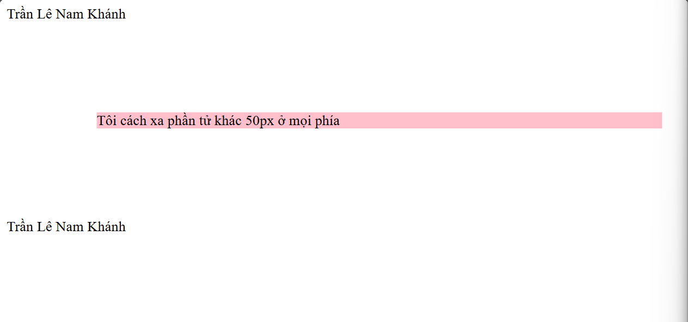
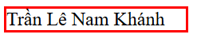
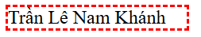
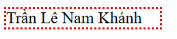
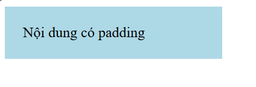
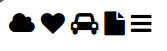
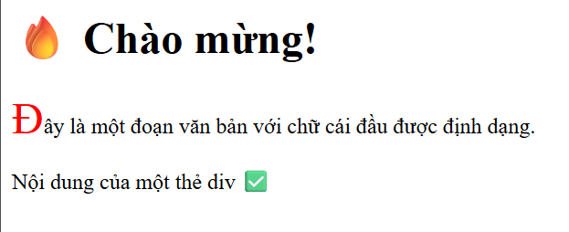

# Buổi 2: CSS(Part 1)   

- [Buổi 2: CSS(Part 1)](#buổi-2-csspart-1)
  - [1. CSS là gì?](#1-css-là-gì)
  - [2. Selectors](#2-selectors)
  - [3. Các loại CSS thường gặp](#3-các-loại-css-thường-gặp)
    - [3.1. Selector cơ bản:](#31-selector-cơ-bản)
  - [4. Ba kiểu chèn CSS(Inline, Internal, External):](#4-ba-kiểu-chèn-cssinline-internal-external)
    - [4.1. Inline CSS:](#41-inline-css)
    - [4.2. Internal CSS:](#42-internal-css)
    - [4.3. External CSS:](#43-external-css)
  - [5. Colors, Backgrounds, Height, Width, Z-index, Overflow, Opacity:](#5-colors-backgrounds-height-width-z-index-overflow-opacity)
    - [5.1. Colors:](#51-colors)
    - [5.2. Backgrounds - Hình nền, màu nền](#52-backgrounds---hình-nền-màu-nền)
    - [5.3. Height \& Width:](#53-height--width)
    - [5.4. Z-Index (Lớp chồng):](#54-z-index-lớp-chồng)
    - [5.5. Overflow:](#55-overflow)
    - [5.6. Opacity:](#56-opacity)
  - [6.Box Model, Borders, Padding, Margin](#6box-model-borders-padding-margin)
    - [6.1. Margin](#61-margin)
    - [6.2. Borders](#62-borders)
    - [6.3. Padding](#63-padding)
  - [7. Text, Fonts, Icons, List, Table](#7-text-fonts-icons-list-table)
    - [7.1. Text](#71-text)
    - [7.2. Fonts](#72-fonts)
    - [7.3. Icons](#73-icons)
    - [7.4. List](#74-list)
    - [7.5. Table](#75-table)
  - [8. Display(Inline, Block, None)](#8-displayinline-block-none)
    - [8.1. Inline](#81-inline)
    - [8.2. Block](#82-block)
    - [8.3. None](#83-none)
    - [8.4. Phân biệt display: none với visibility: hidden](#84-phân-biệt-display-none-với-visibility-hidden)
  - [9. Position](#9-position)
    - [9.1. Các giá trị phổ biến của position](#91-các-giá-trị-phổ-biến-của-position)
  - [10. Combinator selectors](#10-combinator-selectors)
    - [10.1. Descendant Combinator - `A B`](#101-descendant-combinator---a-b)
    - [10.2. CHild combinator - `A > B`](#102-child-combinator---a--b)
    - [10.3. Adjacent sibling combinator - `A + B`](#103-adjacent-sibling-combinator---a--b)
    - [10.4. General sibling combinator - `A ~ B`](#104-general-sibling-combinator---a--b)
  - [11. Pseudo-elements, Pseudo-classes](#11-pseudo-elements-pseudo-classes)
    - [11.1. Pseudo-classes:](#111-pseudo-classes)
    - [11.2. Pseudo-elements(`::`)](#112-pseudo-elements)
  - [12. Relative \& Absolute](#12-relative--absolute)
    - [12.1. Absolute Units - Đơn vị tuyệt đối](#121-absolute-units---đơn-vị-tuyệt-đối)
    - [12.2 Relative Units - Đơn vị tương đối](#122-relative-units---đơn-vị-tương-đối)
  - [13. !important](#13-important)
  - [14. Math Functions](#14-math-functions)
    - [14.1. calc(): Hàm tính toán](#141-calc-hàm-tính-toán)
    - [14.2. min(): Lấy giá trị nhỏ nhất](#142-min-lấy-giá-trị-nhỏ-nhất)
    - [14.3. clamp(min, preffered, max): ràng buộc giá trị trong khoảng](#143-clampmin-preffered-max-ràng-buộc-giá-trị-trong-khoảng)
  - [15. Variables, Box Sizing, Reset CSS](#15-variables-box-sizing-reset-css)
    - [15.1. CSS Variables:](#151-css-variables)
    - [15.2. Box sizing(kích thước hộp)](#152-box-sizingkích-thước-hộp)
    - [15.3. Reset CSS:](#153-reset-css)


## 1. CSS là gì?
- CSS(Cascading Style Sheets) là ngôn ngữ dùng để trang trí và định dạng các phần tử HTML: màu sắc, bố cục, phông chữ, kích thước, hiệu ứng

Ví dụ:
```html
<p style="color : red">Đây là văn bản màu đỏ</p>
```
Kết quả:
<p style="color : red">Đây là văn bản màu đỏ</p>

## 2. Selectors
- **Khái niệm**: Selectors trong CSS dùng để chọn ra phần tử HTML mà ta muốn áp dụng kiểu(style). Nói cách khác, nó giúp xác định áp dụng style nào cho thẻ nào hoặc nhóm thế nào.
-> Ví dụ: Nếu muốn đổi màu chữ của tất cả đoạn văn (<p>), thì p là selector.

- **Cú pháp đầy đủ của CSS Selector**:
```html
selector {
    property: value;
}
```
-> ***Ý nghĩa:***
    + **Selector**: Bộ chọn(thẻ hoặc nhóm thẻ HTML cần định dạng)
    + **property**: Thuộc tính CSS muốn thay đổi(màu, kích thước, nền,...)
    + **value**: giá trị gán cho thuộc tính

## 3. Các loại CSS thường gặp
### 3.1. Selector cơ bản:

|Loại selector | Cú pháp  | Ý nghĩa  | Ví dụ  |
|---|---|---|---|
|  Toàn bộ | <p><code>*</code></p>  |  Chọn mọi phần tử trng HTML | <p><code>* { margin: 0, padding: 0;}</code></p>   |
| Thẻ |<p><code>tagname</code></p>  | Chọn tất care thẻ cụ thể| <p><code>p {color: blue;}</code></p>  |
|Class |<p><code>.classname</code></p>  | Chọn phần tử có class tương ứng|<p><code>.note {background: yellow; }</code></p>  |
| ID| <p><code>#idName</code></p> |Chọn phần tử có ID tương ứng |<p><code>#main-title {font-size: 32px; }</code></p>  |

- Ví dụ:
```html
<p class="note">Đây là đoạn văn đặc biệt.</p>
<p id="main-title">Tiêu đề chính</p>
```

```css
.note {
    background-color: yellow;
}

#main-title{
    font-weight: bold;
}
```

## 4. Ba kiểu chèn CSS(Inline, Internal, External):
### 4.1. Inline CSS:
| Đặc điểm | Ưu điểm | Nhược điểm |
|---|---|---|
| Viết trực tiếp trong thuộc tính `<code>style</code>` của thẻ HTML <br> Áp dụng cho duy nhất một phần tử | Nhanh, đơn giản cho style nhỏ lẻ, test nhanh | Khó bảo trì, khó tái sử dụng, phá vỡ nguyên tắc tách riêng nội dung và trình bày |

- Ví dụ:
```html
<h1 style="color: red, font-size: 30px;">Tiêu đề màu đỏ</h1>
```

### 4.2. Internal CSS:
| Đặc điểm  | Ưu điểm  | Nhược điểm|
|---|---|---|
|- Viết trong thẻ <code>`<style>`</code> nằm trong phần <code>`head`</code> của file HTML <br> - Áp dụng cho toàn bộ trang HTML đó | - Gọn gàng hơn inline, dễ quản lý trong 1 file HTML | - Không tái sử dụng được cho nhiều trang HTML khác |

- Ví dụ:
```html
<!DOCTYPE html>
<html>
<head>
    <style>
        p {
            color: blue;
            font-family: Arial;
        }
    </style>
</head>    
<body>
        <p>Đoạn văn màu xanh</p>
</body>
</html>
``` 

### 4.3. External CSS:

| Đặc điểm  | Ưu điểm  | Nhược điểm|
|---|---|---|
|- CSS được viết trong ***file riêng*** có đuôi <code>.css</code>(ví dụ: <code>style.css</code>) <br> - Được **liên kết** vào file HTML bằng thẻ <code>`<link>`</code> trong phần `<head>` |- **Tái sử dụng** được cho nhiều trang <br> - **Tách riêng nội dung** và trình bày chuyên nghiệp <br> - Dễ bảo trì, phù hợp dự án lớn  | - Phải tải thêm file nên phụ thuộc kết nối |

- Ví dụ:
    + file HTML:
    ```html
    <!DOCTYPE html>
    <html>
    <head>
        <link rel="stylesheet" href="style.css">
    </head>
    <body>
        <h2>Chào bạn!</h2>
    </body>
    </html>
    ```

    + file CSS:
    ```css
    h2 {
        color: green;
        font-size: 24px;
    }
    ```

## 5. Colors, Backgrounds, Height, Width, Z-index, Overflow, Opacity:

### 5.1. Colors:
- Dùng để thiết lập:
    + Màu chữ (color)
    + Màu nền (background-color)
    + Có thể dùng: tên màu, mã HEX, RGB,...
- Ví dụ:
```html
<p style="color: red;">Chữ màu đỏ</p>
<p style="color: #00ccff;">Chữ màu xanh nhạt(HEX)</p>
<p style="color: rgb(0,128,0)">Chữ màu xanh lá(RGB)</p>
```

<p style="color: red;">Chữ màu đỏ</p>
<p style="color: #00ccff;">Chữ màu xanh nhạt(HEX)</p>
<p style="color: rgb(0,128,0)">Chữ màu xanh lá(RGB)</p>

### 5.2. Backgrounds - Hình nền, màu nền
- Các thuộc tính thường dùng:
    + <code>background-color</code>: màu nền
    + <code>background-image</code>: ảnh nền
    + <code>background-repeat</code>: lặp ảnh nền
    + <code>background-size</code>: kích thước ảnh nền
    + <code>background-position</code>: vị trí ảnh nền
    + <code>background</code>: rút gọn tất cả
=> Thay vì viết từng dòng như này:

```css 
background-color: lightblue;
background-image: url("image.jpg");
background-repeat: no-repeat;
background-position: center center;
background-attachment: fixed;
```

thì ta có thể rút gọn thành như này:
```css
background: lightblue url("image.jpg") no-repeat center center fixed;
```

### 5.3. Height & Width:
- Được dùng để thiết lập kích thước phần tử(cố định hoặc % so với phần tử cha)
- Ví dụ:
```html
Set kích thước cố định
<div style="width: 300 px; height: 150 px; background-color: orange;">Box 300x150</div>
Set kich thước theo tỉ lệ so với cái gốc
<div style="width: 50%; height: 100px; background-color: green;">
  Rộng 50% phần tử cha
</div>
```

### 5.4. Z-Index (Lớp chồng):
- Quy định thứ tự chồng lấp giữa các phần tử(cao hơn nằm trên)
- Chỉ hoạt động với phần tử có **position: relative, absolute, hoặc fixed.**
- Ví dụ:
```html
<div style="position: absolute; z-index: 1; background: red; width: 200px; height: 200px;">
  Box đỏ (z-index: 1)
</div>

<div style="position: absolute; z-index: 2; background: blue; width: 150px; height: 150px; top: 30px; left: 30px;">
  Box xanh (z-index: 2)
</div>

```

- Kết quả:


### 5.5. Overflow:
- Xử lý khi nội dung vượt quá kích thước phần tử:
| Giá trị  | Ý nghĩa  |
|---|---|
| visible   | Hiển thị vượt ra ngoài(mặc định)   |
| hidden| Ẩn phần bị tràn|
|scroll|Luôn có thanh cuộn|
|auto|Có thanh cuộn khi cần|

- Ví dụ:
```html
<div style="width: 200px; height: 100px; overflow: auto; background-color: lightgrey;">
  Nội dung rất dài rất dài rất dài rất dài rất dài rất dài rất dài rất dài rất dài rất dài
</div>

```

### 5.6. Opacity:
- Điều chỉnh **độ trong suốt** của phần tử, nằm trong khoảng 0-1,(trong suốt -> rõ nét hoàn toàn)
- Ví dụ:
```html
<div style="width: 250px;color: black;background-color: green; opacity: 0.72; padding: 20px;">AC : Accepted</div>
```


## 6.Box Model, Borders, Padding, Margin


- Mỗi phần tử HTML được hiển thị trên trang web đều được xem như một chiếc hộp. Box model giúp xác định kích thước thật sự của phần tử trên trang, gồm 4 phần: **margin**(khoảng cách với phần tử khác), **border**(viền bao quanh nội dung), **padding**(khoảng cách từ nội dung đến viền), **content**(nội dung chính)

### 6.1. Margin
- Là khoảng trống bên ngoài viền phần tử, tạo khoảng cách với các phần tử khác
- Có thể áp dụng riêng từng phía: **margin-top**, **margin-bottom**, **margin-left** hoặc viết gộp **margin**
- Ví dụ: 
```html
<div style="margin: 50px; background: pink;">
  Tôi cách xa phần tử khác 30px ở mọi phía
</div>
```



### 6.2. Borders
- Là đường viền bao quanh phần tử
- Cấu trúc: <code>border: độ dày kiểu màu</code>
- Các kiểu viền:
    + **solid**: đường liền
    + **dashed**: nét đứt
    + **dotted**: chấm tròn
    + **none**: không có

- Ví dụ:
    + **Solid**: 
        
    
    + **Dashed**:
        
    
    + **Dotted**:
        
    
    + **None**:
        

### 6.3. Padding
- Là khoảng cách từ nội dung đến viền (border)
- Có thể áp dụng riêng từng phía: **padding-top**, **padding-right**, **padding-bottom**, **padding-left**, hoặc viết gộp: **padding**.
- Ví dụ: 
```html
<div style="width: 200px; padding: 20px; background-color: lightblue;">
  Nội dung có padding
</div>
```


## 7. Text, Fonts, Icons, List, Table
### 7.1. Text
|Thuộc tính|Ý nghĩa|Ví dụ|
|---|---|---|
|**color**|Màu chữ|color: red|
|**text-align**|Căn lề|left, center, right|
|**text-decoration**|Gạch chân, gạch ngang,..|none, underline, line-through|
|**text-transform**|Chuyển đổi chữ hoa/thường|uppercase, lowercase|
|**letter-spacing**|Khoảng cách giữa các chữ cái|letter-spacing: 2px;|
|**line-height**|Khoảng cách giữa các dòng|line-height: 1.5;|

### 7.2. Fonts
|Thuộc tính|Ý nghĩa|Ví dụ|
|---|---|---|
|**font-family**|Phông chữ|font-family: Arial, sans-serf;|
|**font-size**|Cỡ chữ|font-size: 16px;|
|**font-weight**|Độ đậm|normal, bold, 500, 700|
|**font-style**|Kiểu chữ nghiêng|italic, normal|
|**font-variant**|Dùng chữ viết hoa nhỏ|small-caps|

### 7.3. Icons
- Cách phổ biến để dùng icon:
    + Dùng Font Awesome hoặc Google Material Icons
    + Cần nhúng thư viện vào HTML trước
- Ví dụ với Font Awesome:
    + 1. Nhúng CDN:
    ```html
    <head>
        <link rel="stylesheet" href="https://cdnjs.cloudflare.com/ajax/libs/font-awesome/6.4.0/css/all.min.css">
    </head>
    ```
    + 2. Dùng icon:
    ```html
    <i class="fa fa-cloud"></i>
    <i class="fa fa-heart"></i>
    <i class="fa fa-car"></i>
    <i class="fa fa-file"></i>
    <i class="fa fa-bars"></i>
    ```

=> Kết quả:



### 7.4. List
- Các thuộc tính thường dùng

|Thuộc tính| Ý nghĩa| Ví dụ|
|---|---|---|
|**list-style-type**|Kiểu ký hiệu đầu dòng|disc, circle, square, decimal|
|**list-style-position**|Vị trí dấu(inside/outside)|inside, outside|
|**list-style-image**|Dùng ảnh thay bullet|url("icon.png")|

### 7.5. Table
- Các thuộc tính:

|Thuộc tính|Ý nghĩa|
|---|---|
|**border**|Đường viền|
|**border-collapse**|Gộp đường viền liền nhau|
|**text-align**|Căn chữ trong ô|
|**padding**|Khoảng cách trong ô|
|**background-color**|Màu nền cho hàng, cột, ô|

## 8. Display(Inline, Block, None)
- **display** là một thuộc tính rất quan trọng, xác định cách một phần tử HTML hiển thị trên trang web:
    + Nó quyết định phần tử đó chiếm bao nhiêu không gian,
    + Có xuống dòng hay không
    + Có ẩn đi hay không

### 8.1. Inline
- Không xuống dòng, hiển thị trên cùng một dòng với phần tử khác
- Không thể đặt width, height
- Chỉ chiếm **vừa đủ nội dung bên trong nó**
- Ví dụ:
```html
<span style="display: inline; color: red;">Từ 1</span>
<span style="display: inline; color: blue;">Từ 2</span>
```
- Kết quả: "Từ 1" và "Từ 2" nằm cạnh nhau trên cùng một dòng


### 8.2. Block
- Chiếm toàn bộ chiều ngang(theo dòng).
- Luôn xuống dòng sau khi hiển thị
- Có thể đặt width, height, margin, padding
- Ví dụ:
```html
<div style="display: block; background-color: lightblue;">
  Đây là div hiển thị dạng block
</div>
<p style="display: block; color: green;">
  Đoạn văn bản này cũng là block
</p>
```
- Kết quả: div và p nằm trên dòng riêng, chiếm toàn bộ chiều ngang khung cha

### 8.3. None
- Phần tử không hiển thị gì cả
- Không chiếm không gian(khác với visibility: hidden)
- Dùng để ẩn phần tử tạm thời

### 8.4. Phân biệt display: none với visibility: hidden
- `display: none` **ẩn hoàn toàn** phẩn tử khỏi giao diện, trình duyệt **không dành không gian** cho nó, không thể tương tác, không chiếm chỗ
```html
<p style="display: none;">Tôi đã biến mất hoàn toàn!</p>
```
-> Đoạn văn này không xuất hiện và không chiếm chỗ trên màn hình.

- `visibility: hidden`, phần tử **vẫn tồn tại trong DOM** và chiếm chỗ trong layout, ẩn nội dung, nhưng không phá vỡ bố cục xung qunah, không thể tương tác
```html
<p style="visibility: hidden;">Tôi bị ẩn nhưng vẫn chiếm chỗ!</p>
```
-> Phần tử bị ẩn đi, **vẫn giữ khoảng trống** như thể nó đang hiện diện

- Khi nào dùng cái nào:

|Tình huống| Nên dùng|
|---|---|
|Cần **ẩn hoàn toàn** và **không ảnh hưởng layout**|`display: none`|
|Cần ẩn tạm thời, vẫn giữ bố cục|`visibility: hidden`|
|Ẩn/hiện bằng JS|Cả hai đều được dùng, tùy nhu cầu|
|Làm hiệu ứng mờ dần rồi ẩn|`visibility` kết hợp với `opacity`|

## 9. Position
- **Position** quy định cách một phần tử được định vị trong tài liệu HTML. Khi sử dụng **position**, ta thường kết hợp với các thuộc tính như:
    + top
    + right
    + bottom
    + left
-> Để **di chuyển phần tử** theo chiều dọc hoặc ngang so với một gốc tham chiếu nào đó.

### 9.1. Các giá trị phổ biến của position
- **static(mặc định)**:
    + là giá trị **mặc định** của các phần tử
    + Phần tử **nằm theo luồn bình thường** của tài liệu
    + Không thể dùng top, left,...
    + Ví dụ:
    ```html
    <div style="position: static; top: 50px;">Tôi sẽ không di chuyển</div>
    ```
    -> Không có tác dụng với <code>top: 50px</code>

- **relative**:
    + Phần tử được **định vị tương đối** với chính nó
    + Có thể dùng top, left, right, bottom
    + Vị trí gốc vẫn giữ chỗ trong luồng tài liệu
    + Ví dụ:
    ```html
    <div style="position: relative; top: 20px; left: 30px;">Di chuyển so với vị trí ban đầu
    </div>
    ```
    -> Phần tử này di chuyển nhưng vẫn chiếm chỗ như ban đầu

- **absolute**:
    + Phần tử được **định vị tương đối với phần tử cha gần nó nhất** có <code>position: relative| absolute | fixed</code>
    + Nếu không có phần tử cha phù hợp, sẽ định vị theo `<html>` hoặc `<body>`
    + **Không giữ chỗ trong luồng tài liệu**
    + Ví dụ:
    ```html
    <div style="position: relative;">
    <div style="position: absolute; top: 10px; left: 20px;">Định vị tuyệt đối bên trong phần tử cha</div>
    </div>
    ```

- **fixed**:
    + Phần tử được định vị so với **cửa số trình duyệt(viewport)**
    + Không di chuyển kể cả khi cuộn trang
    + Ví dụ:
    ```html
    <div style="position: fixed; top: 0; right: 0; background: yellow;">Tôi luôn nằm ở góc phải trên
    </div>
    ```
    -> Dùng cho nút quay lên đầu trang, header cố định,...

- **sticky(bán cố dịnh)**:
    + Phần tử hoạt động như `relative` lúc đầu, nhưng sẽ chuyển sang `fixed` khi cuộn tới vị trí nhất định
    + Cần có `top`, `bottom` để kích hoạt
    + Ví dụ:
    ```html
    <h2 style="position: sticky; top: 0; background: white;">Tôi sẽ dính ở trên khi cuộn
    </h2>
    ```
    -> Rất hữu ích cho menu điều hướng dính đầu trang

- **Bảng so sánh nhanh**:

|Giá trị|Định vị theo|Giữ chỗ|Có thể dùng top/left|Ứng dụng|
|---|---|---|---|---|
|`static`| Luồng HTML thông thường|Có|Không|Mặc định|
|`relative`|Vị trí ban đầu của chính nó|Có|Có|Dịch nhẹ không phá layout|
|`absolute`|Phần tử cha có position|Không|Có|Tooltip, pop-up|
|`fixed`|viewport|Không|Có|Menu dính, nút quay lên|
|`sticky`|Viewport sau khi cuộn đến điểm cụ thế|Có|Có|Header cuộn cố định|

## 10. Combinator selectors
- Trong CSS, combinators là các ký hiệu đặc biệt để chọn phần tử dựa trên mối quan hệ giữa các phần tử HTML, như cha-con, anh-em, hậu duệ
- COmbinator dùng để kết hợp nhiều selector lại với nhau theo mối quan hệ nhất định
- Các loại Combinator chính

|Ký hiệu|Tên gọi|Mối quan hệ|
|---|---|---|
|`space`| Descendant|Hậu duệ bất kỳ cấp|Hậu duệ bất kỳ cấp|
|`>`|Child|Con trực tiếp|
|`+`|Adjacent sibling|Anh em kế tiếp|
|`~`|General sibling|Tất cả anh em phía sau| 

### 10.1. Descendant Combinator - `A B`
- Chọn mọi phần tử `B` là **hậu duệ**(bất kì cấp) của `A`
- Ví dụ:
```css
div p{
    color: red;
}
```
-> Tất cả thẻ `<p>` bên trong `<div>` (kể cả sâu nhiều lớp) sẽ có màu đỏ.
```html
<div>
    <section>
        <p>Đây là đoạn văn</p> <!-- bị ảnh hưởng-->
    </section>
</div>
```

### 10.2. CHild combinator - `A > B`
- Chọn phần tử `B` là con trực tiếp của `A`
- Ví dụ:
```css
div > p{
    color: green;
}
```
-> Chỉ <p> là **con trực tiếp** của `<div>` mới bị ảnh hưởng

```html
<div>
    <p>Được chọn (con trực tiếp)</p>
    <section>
        <p>Không được chọn</p>
    </section>
</div>
```

### 10.3. Adjacent sibling combinator - `A + B`
- Chọn phần tử `B` là anh em kế ngay sau `A`
- Ví dụ:
```css
h1 + p {
    color: blue;
}
```
->Chỉ `<p>` ngay sau `<h1>` mới áp dụng
```html
<h1>Tiêu đề</h1>
<p>Đoạn văn được tô màu xanh dương</p>
<p>Không bị ảnh hưởng</p>
```

### 10.4. General sibling combinator - `A ~ B`
- Chọn tất cả phần tử `B` là **anh em phía sau** `A`(không cần liền kề)
- Ví dụ:
```css
h1 ~ p {
    color: orange;
}
```
-> Tất cả `<p>` cùng cấp và phía sau `<h1>` đều bị ảnh hưởng
```html
<h1>Tiêu đề</h1>
<span>abc</span>
<p>Được chọn</p>
<p>Được chọn</p>
```

## 11. Pseudo-elements, Pseudo-classes
### 11.1. Pseudo-classes:
- Là các từ khóa được thêm vào sau selector, để áp dụng style khi phần tử ở một trạng thái nhất định(là phần tử con đầu tiên, đã được click,..)
- Cú pháp:
```css
selector: pseudo-class {
    /* style */
}
```
- Một số pseudo-classes phổ biến:

|Pseudo-class|Ý nghĩa|
|---|---|
|`: hover`| KHi người dùng di chuột vào|
|`:active`|Khi phần tử đang được click|
|`:focus`|Khi phần tử được focus(như input)|
|`:first-child`|Phần tử là con đầu tiên|
|`:last-child`|Phần tử là con cuối cùng|
|`:nth-child`|Phần tử con thứ n|
|`:checked`|Radio/checkbox đang được chọn|
|`:disabled`|Phần tử bị vô hiệu hóa|
|`:not(selector)`|Chọn tất cả trừ selector đã cho|

- Ví dụ:

```css
button: hover{
    background-color: yellow;
}
li: nth-child(2) {
    color: red;
}
input: focus {
    border-color: blue;
}
```

### 11.2. Pseudo-elements(`::`)
- Dùng để tạo ra và định kiểu cho phần tử ảo(không tồn tại trong HTML), như phần trước hoặc sau nội dung, hay chữ cái đầu tiên của đoạn văn
- Cú pháp:
```css
selector::pseudo-element {
    /* style */
}
```

- Một số pseudo-elements phổ biến:

|Pseudo-element|Ý nghĩa|
|---|---|
|`::before`|Tạo nội dung ảo trước nội dung thật|
|`::after`|Tạo nội dung ảo sau nội dung thật|
|`::first-letter`|Chữ cái đầu tiên|
|`::first-line`|Dòng đầu tiên|
|`::selection`|Phần được người dùng bôi đen select|

- Ví dụ:

```html
<!DOCTYPE html>
<html>
<head>
<style>
p::first-letter {
  font-size: 2em;
  color: red;
}

h1::before {
  content: "🔥 ";
}

div::after {
  content: " ✅";
  color: green;
}
</style>
</head>

<body>
  <h1>Chào mừng!</h1>
  <p>Đây là một đoạn văn bản với chữ cái đầu được định dạng.</p>
  <div>Nội dung của một thẻ div</div>
</body>
</html>
```

-> Kết quả:



## 12. Relative & Absolute
- Trong CSS, đơn vị đo dùng để xác định kích thước được chia làm 2 loại chính

### 12.1. Absolute Units - Đơn vị tuyệt đối
- Đây là các đơn vị có kích thước cố định, không thay đổi theo cỡ màn hình hay phần tử cha: px, cm, mm, in, pt(Point/ 1pt = 1/72 inch), pc(Pica/ 1pc = 12pt)

### 12.2 Relative Units - Đơn vị tương đối
- Phụ thuộc vào kích thước của phần tử cha, gốc hoặc môi trường hiển thị: `%`, `em`(dựa vào font size của cha), `rem`(dựa vào font-size của html),..


## 13. !important
- Trong CSS, `!important` là từ khóa đặc biệt dùng để ưu tiên áp dụng một thuộc tính ngay cả khi nó bị các quy tắc khác ghi đè
- Khi nào nền dùng `!important`:
    + Khi muốn đảm bảo một thuộc tính luôn được áp dụng, bất chấp các CSS khác
    + Khi cần ghi đè nhanh mà không thể thay đổi cấu trúc HTML hoặc selector
-> Không nên lạm dụng `!important` vì nó phá vỡ nguyên tắc **cascade** của CSS, gây khó bảo trì, đặc biệt trong các dự án lớn

## 14. Math Functions
- Trong CSS, math functions là các hàm toán học cho phép bạn thực hiện các phép tính trực tiếp trong thuộc tính CSS. Đây là một phần rất mạnh mẽ giúp viết CSS linh hoạt, tự động tính toán kích thước thay vì phải tính tay

### 14.1. calc(): Hàm tính toán
- Dùng để tính toán kích thước bằng cách kết hợp nhiều đơn vị như `%`, `px`, `em`,`rem`,..
- Cú pháp:
```css
width: calc(100% - 50px);
```
- Ví dụ:
```html
<div style="width: calc(100% - 40px); background-color: lightblue;">
    Tôi có chiều rộng bằng 100% trừ đi 40px
</div>
```

<div style="width: calc(100% - 40px); background-color: lightblue;">
  Tôi có chiều rộng bằng 100% trừ đi 40px
</div>

### 14.2. min(): Lấy giá trị nhỏ nhất
```css
width: min(50vw, 500px);
```
-> Nghĩa là chiều rộng sẽ là giá trị nhỏ hơn giữa 50% chiều rộng màn hình và 500px.

### 14.3. clamp(min, preffered, max): ràng buộc giá trị trong khoảng
-> Rất phổ biến trong thiết kế responsive hiện đại

```css
font-size: clamp(16px, 4vw, 32px);
```

-> 16px kích thước tối thiểu, 4vw là giá trị linh hoạt dựa vào chiều rộng màn hình, không lớn hơn 32px

## 15. Variables, Box Sizing, Reset CSS
### 15.1. CSS Variables:
- cho phép lưu trữ và tái sử dụng giá trị CSS trong toàn bộ stylesheet, giúp giảm thiểu việc lặp lại và dễ dàng chỉnh sửa giá trị ở một nơi duy nhất
- Cú pháp:

```
:root {
  --main-bg-color: lightblue; /* Định nghĩa biến */
}

div {
  background-color: var(--main-bg-color); /* Sử dụng biến */
}
```
- `--main-bg-color` là một biến CSS
- `var(--main-bg-color)` được sử dụng để lấy giá trị của biến và áp dụng cho phần tử
- Ví dụ:
```html
<!DOCTYPE html>
<html lang="en">
<head>
  <meta charset="UTF-8">
  <meta name="viewport" content="width=device-width, initial-scale=1.0">
  <title>CSS Variables</title>
  <style>
    :root {
      --primary-color: #3498db;
      --secondary-color: #2ecc71;
    }

    body {
      font-family: Arial, sans-serif;
    }

    h1 {
      color: var(--primary-color);
    }

    p {
      color: var(--secondary-color);
    }
  </style>
</head>
<body>
  <h1>Chào mừng bạn!</h1>
  <p>Đây là một ví dụ về CSS Variables.</p>
</body>
</html>
```
### 15.2. Box sizing(kích thước hộp)
- Box model trong CSS xác định cách các phần tử được bố trí và chiếm không gian trong trang. Để hiểu rõ hơn về kích thước hộp, cần hiểu các thành phần trong Box Model: Content, padding, border, margin
- `content-box`: Mặc định, chỉ tính nội dung (không bao gồm padding và border) khi xác định chiều rộng và chiều cao.
- `border-box`: Tính cả padding và border vào trong tổng chiều rộng và chiều cao của phần tử.

### 15.3. Reset CSS:
- Reset CSS là kỹ thuật giúp bạn xóa bỏ các thiết lập mặc định của trình duyệt(như margin, padding, font size,...) để tạo ra một nền tảng đồng nhất cho thiết kế trang web của bạn
- Lý do cần Reset CSS: Mỗi trình duyệt có cách thiết lập mặc định khác nhau cho các thẻ HTML, và điều này có thể khiến trang web của mình trông không giống nhau trên các trình duyệt khác nhau
- Cú pháp của một reset CSS cơ bản:
```css
/* Reset tất cả các thẻ về 0 */
* {
  margin: 0;
  padding: 0;
  box-sizing: border-box;
}

/* Reset font của body */
body {
  font-family: Arial, sans-serif;
  font-size: 16px;
}
```