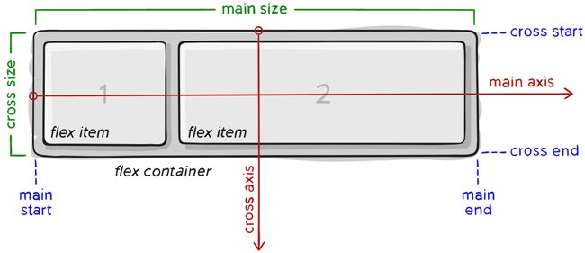
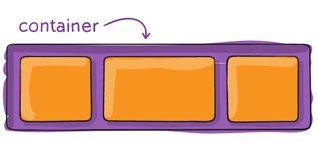
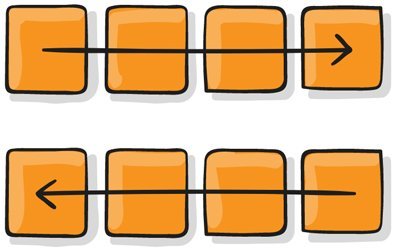
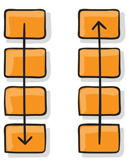

# Buổi 3: CSS(Phần 2)

## 1. Flexbox, Flex attribute: direction, wrap, flow
### 1.1. Flexbox là gì?
- **Flexbox Layout (còn gọi là Flexible Box hay CSS Flex Box)** là một kiểu bố cục trang có khả năng tự cân đối kích thước, thay đổi chiều rộng/cao và thứ tự phần tử bên trong để phù hợp với tất cả các loại thiết bị hiển thị và kích thước màn hình
- Với bố cục bình thường, bạn cần phải thiết lập kích thước của phần tử, thiết lập hiển thị dạng block hay inline, cho nó float, còn với Flexbox bạn chỉ cần thiết lập phần hiển thị theo chiều ngang hay dọc, lúc đó các phần tử bên trong có thể hiển thị theo ý muốn.
- **Lưu ý**: Flexbox Layout phù hợp nhất để thiết lập bố cục ở quy mô nhỏ, còn thiết lập bố cục với phạm vi lớn hơn thì vẫn nên sử dụng kiểu thông thường là dàn trang theo dạng lưới (grid layout).

### 1.2. Các khái niệm cơ bản và thuật ngữ
- **Bố cục flex**: được thiết lập từ một khung lớn (parent container) đóng vai trò là khung linh hoạt (flex container) và các thẻ con ngay trong nó (immediate children) đóng vai trò các mục nhỏ linh hoạt(flex item)
- Sơ đò cấu trúc Flexbox:


- Thành phần quan trọng nhất của Flexbox là
    + **container**: là thành phần lớn bao quanh các phần tử bên trong, các item bên trong sẽ hiển thị dựa trên thiết lập của container này.
    + **item**: là phần tử con của container, bạn có thể thiết lập nó sẽ sử dụng bao nhiêu cột trong một container, hoặc thiết lập thứ tự hiển thị của nó.
  + 

- Các item sẽ được bố trí theo trục main axis (bắt đầu từ main-start, kết thúc ở main-end) hoặc theo trục cross axis (bắt đầu từ cross-start, kết thúc ở cross-end).
- **main axis**: đây là trục chính để điều khiển hướng mà các item sẽ hiển thị. Lưu ý, main axis không phải lúc nào cũng nằm ngang như sơ đồ trên, bạn có thể sử dụng thuộc tính flex-direction để thay đổi hướng của trục và lúc đó các item sẽ hiển thị theo nó.
- **main-start | main-end**: khi thiết lập flexbox, các item nằm trong container hiển thị từ điểm bắt đầu gọi là main-start tới điểm kết thúc gọi là main-end.
- **main size**: kích thước (chiều rộng hoặc chiều cao) của các item, tùy thuộc vào hướng của main axis.
- **cross axis**: cross axis luôn là trục vuông góc của main axis. Hướng của nó phụ thuộc vào hướng của main axis.
- **cross-start | cross-end**: có ý nghĩa tương tự nhưng luôn vuông góc với main start, main end.
- **cross size**: kích thước (chiều rộng hoặc chiều cao) của các item dựa trên trục cross axis, tùy thuộc vào hướng của main axis.

### 1.3. Các thuộc tính của Flex Container
- **display**: Để dử dụng flex trong CSS thì đơn giản là chúng ta chỉ cần khai báo thuộc tính  `display: flex`
```html
.container {display: flex; /* hoặc inline-flex */ }
```
- **Lưu ý**: các cột CSS thông thường không sử dụng được trong flex container

#### 1.3.1. flex-direction
- **Thuộc tính flex-direction** xác định hướng của main-axis để container sắp xếp các item
- 
- 
- **Cú pháp:**
```html
.container {
    flex-direction: row| row-reverse|column| column-reverse;
}
```
- **Các tham số:**
    + **row**: mặc định, flex item được sắp xếp theo chiều ngang, **từ trái qua phải** (main axis nằm ngang).
    + **row-reverse**: flex item được sắp xếp theo chiều ngang, **từ phải qua trái** (main axis nằm ngang).
    + **column**: flex item được sắp xếp theo chiều dọc, từ **trên xuống dưới** (main axis đứng dọc).
    + **column-reverse**: flex item được sắp xếp theo chiều dọc, **từ dưới lên trên** (main axis đứng dọc).