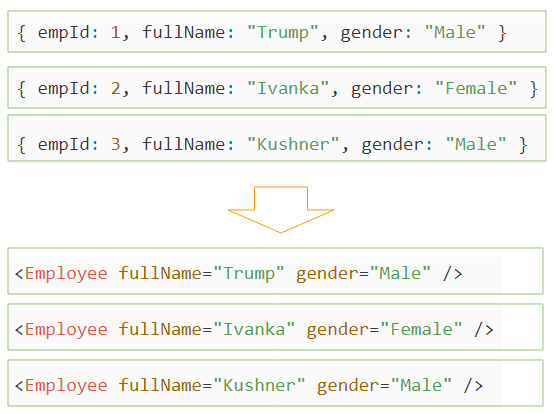
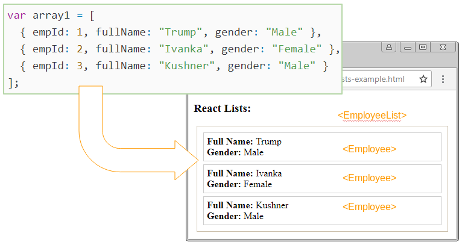
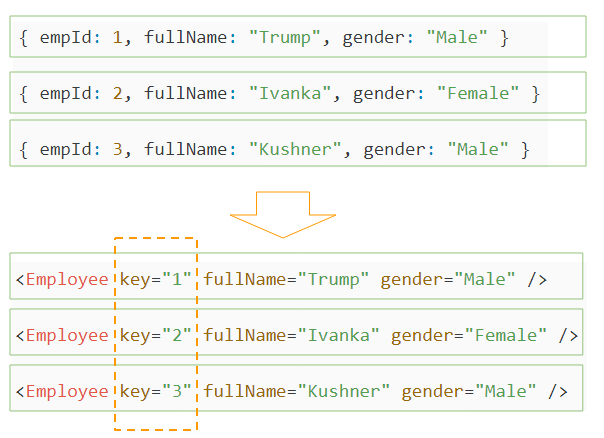

# REACT BUỔI 1

- [REACT BUỔI 1](#react-buổi-1)
  - [Phần 1: Cài đặt môi trường, kiến thức cơ bản về REACT](#phần-1-cài-đặt-môi-trường-kiến-thức-cơ-bản-về-react)
    - [1.1. Giới thiệu về React](#11-giới-thiệu-về-react)
    - [1.2. Lợi ích của React](#12-lợi-ích-của-react)
    - [1.3. Cài đặt môi trường REACT](#13-cài-đặt-môi-trường-react)
    - [1.4. Phân biệt vite và React](#14-phân-biệt-vite-và-react)
    - [1.5. JSX (JavaScript XML)](#15-jsx-javascript-xml)
    - [1.6. Component (Class Component vs Function Component)](#16-component-class-component-vs-function-component)
      - [1.6.1. React Component là gì?](#161-react-component-là-gì)
      - [1.6.2. Functional Components:](#162-functional-components)
      - [1.6.3. Class Components](#163-class-components)
    - [1.7. Lists, Keys](#17-lists-keys)
      - [1.7.1. Lists trong React](#171-lists-trong-react)
      - [1.7.2. Keys trong React](#172-keys-trong-react)
    - [1.8. State, Prop](#18-state-prop)
      - [1.8.1 State](#181-state)
      - [1.8.2. Prop (properties)](#182-prop-properties)
    - [1.9. Handling events](#19-handling-events)
      - [1.9.1. Nguyên tắc cơ bản về event trong React](#191-nguyên-tắc-cơ-bản-về-event-trong-react)
    - [1.10. Conditional rendering](#110-conditional-rendering)
      - [1.10.1 Dùng if/else](#1101-dùng-ifelse)
      - [1.10.2. Dùng toán tử ternary (? :)](#1102-dùng-toán-tử-ternary--)
      - [1.10.3. Dùng `&&` (chỉ render khi điều kiện đúng)](#1103-dùng--chỉ-render-khi-điều-kiện-đúng)
      - [1.10.4. Tách thành component nhỏ](#1104-tách-thành-component-nhỏ)
  - [Phần 2: Life cycle](#phần-2-life-cycle)
    - [2.1 Life cycle:](#21-life-cycle)
      - [2.1.1. Life cycle trong Class component](#211-life-cycle-trong-class-component)
      - [2.1.2. lifecycle trong function component (với hooks)](#212-lifecycle-trong-function-component-với-hooks)
    - [2.2. Các Hooks cơ bản: useState và useEffect](#22-các-hooks-cơ-bản-usestate-và-useeffect)
      - [2.2.1. useState - Quản lý trạng thái trong Function Component](#221-usestate---quản-lý-trạng-thái-trong-function-component)
      - [2.2.2. useEffect - Xử lý "tác dụng phụ" (Side effects)](#222-useeffect---xử-lý-tác-dụng-phụ-side-effects)
  - [PHẦN 3: COMPONENT VÀ QUẢN LÝ CẤU TRÚC THƯ MỤC TRONG DỰ ÁN REACT](#phần-3-component-và-quản-lý-cấu-trúc-thư-mục-trong-dự-án-react)
    - [3.1. Quản lý Component trong React](#31-quản-lý-component-trong-react)
    - [3.2. Cấu trúc dự án React](#32-cấu-trúc-dự-án-react)

## Phần 1: Cài đặt môi trường, kiến thức cơ bản về REACT

### 1.1. Giới thiệu về React

- React là một thư viện JavaScript mã nguồn mở do Facebook (nay là Meta) phát triển.

- Ra đời năm 2013, React nhanh chóng trở thành công cụ phổ biến trong việc xây dựng giao diện người dùng (UI), đặc biệt là ứng dụng web có tính tương tác cao.

- React hoạt động dựa trên cơ chế Component (thành phần), giúp chia giao diện thành nhiều phần nhỏ, dễ tái sử dụng và quản lý.

- Điểm nổi bật của React là **Virtual DOM**, giúp cập nhật giao diện nhanh chóng mà không cần tải lại toàn bộ trang.

### 1.2. Lợi ích của React

- Hiệu năng cao: Nhờ Virtual DOM, React chỉ cập nhật những phần thay đổi thay vì render lại toàn bộ trang.
- Tái sử dụng code: Component có thể dùng lại nhiều lần, giúp tiết kiệm thời gian phát triển.
- Cộng đồng lớn: Hệ sinh thái thư viện, plugin, tài liệu phong phú.
- Đa nền tảng: Dùng React DOM cho web, React Native cho ứng dụng di động.
- Hỗ trợ công cụ hiện đại: Kết hợp tốt với TypeScript, Redux, Next.js…

### 1.3. Cài đặt môi trường REACT

- Dùng vite:

  - npm create vite@latest my-app
  - cd my-app
  - npm install
  - npm run dev

- Dùng CRA:
  - npm install -g create-react-app
  - create-react-app my-app

### 1.4. Phân biệt vite và React

- Vite:

  - là 1 công cụ build( build tool) + dev server
  - Được tạo ra để thay thế cho Webpack
  - Vai trò:
    - Chạy dev server nhanh
    - HMR (Hot Module Replacement): khi sửa code, trang web update ngay lập tức mà không reload toàn bộ
    - Bundling + Optimize: khi buile (`npm run build`), Vite dùng Rollup để gom code lại, nén, tối ưu perfomance

- React:
  - là một thư viện JS dùng để xây dựng UI
  - chỉ tập trung vào phần logic và UI: Component, state, props, hooks
  - không quan tâm đến việc chúng ta build project như nào, bundle ra sao, tối ưu tốc độ ra sao

### 1.5. JSX (JavaScript XML)

- là một cú pháp mở rộng của JS, cho phép viết HTML trong JS
- Nó cho phép viết code giống HTML ngay trong file JavaScript, nhưng thật ra JSX sẽ được biên dịch về JavaScript thuần.

```jsx
const element = <h1>Hello, world!</h1>;
```

- Lợi ích:
  - Code dễ đọc (giống HTML).
  - Cho phép nhúng biến JS trực tiếp bằng { }.

```jsx
const name = "Khanh";
const element = <h1>Hello, {name}</h1>;
```

### 1.6. Component (Class Component vs Function Component)

#### 1.6.1. React Component là gì?

- 1 **component** là một block code độc lập, có thể tái sử dụng, nó chia UI thành nhiều phần nhỏ. Mặt khác, có thể nghĩ đơn giản các components như một khối các blocks LEGO. Tương tự, cấu trúc LEGO được tạo từ nhiều blocks LEGO nhỏ, như tạo một web page hoặc UI từ nhiều block code(components).

- Tất nhiên chúng ta không muốn có hàng ngàn dòng code trong cùng một file. Việc maintain code cũng gặp khó khăn khi project càng ngày càng lớn lên.

- Việc chia source code thành các components giúp ta rất nhiều. Mỗi component có code JS và CSS riêng, chúng có thể tái sử dụng, dễ đọc, dễ viết, dễ test.

- React có 2 loại component: **Funtional** (Stateless) và **Class** (Stateful).

#### 1.6.2. Functional Components:

- 1 **functional component** là một hàm Javascript (hoặc ES6) trả về 1 phần tử/1 element React. Theo official docs của React, hàm dưới đây là một component React hợp lệ:

```jsx
function Welcome(props) {
  return <h1>Hello, {props.name}</h1>;
}
```

- Vì vậy mình có thể định nghĩa 1 component như 1 JS Function:

```jsx
function Example() {
  return <h1>I'm a functional component!</h1>;
}
```

hoặc arrow function:

```jsx
const Example = () => {
  return <h1>I'm a functional component!</h1>;
};
```

=> Cả hai functions đều là React component hợp lệ. Chúng có thể nhận props làm tham số(nếu nó cần), nhưng chúng bắt buộc phải trả về React element.

- **QUAN TRỌNG**: Functional components cũng được nói với một cái tên là **stateless components** bởi vì chúng ta không thể làm nhiều thứ phức tạp như quản lý React State (data) hoặc phương thức life-cycle trong functional components.

- Vậy 1 React Functional Component là:
  - một function Javascript / ES6 function
  - phải trả về 1 React element
  - nhận props làm tham số nếu cần

#### 1.6.3. Class Components

- Các Class components là những class ES6. Chúng phức tạp hơn functional components ở chỗ nó còn có: phương thức khởi tạo, life-cycle, hàm render() và quản lý state (data). Ví dụ dưới đây là class component:

```jsx
import React, { Component } from "react";

class ExampleComponent extends Component {
  render() {
    return <div>This is an example component</div>;
  }
}

export default ExampleComponent;
```

- Có thể thấy, class ExampleComponent kế thừa Component, vì vậy React hiểu class này là một component, và nó renders (returns) 1 React Element.

- Vì vậy, một React class component là:
  - là một class ES6, nó sẽ là một component khi nó "kế thừa" React component.
  - có thể nhận props (trong hàm khởi tạo) nếu cần.
  - có thể maintain data của nó với state
  - phải có 1 method render() trả về 1 React + element (JSX), or null

### 1.7. Lists, Keys

#### 1.7.1. Lists trong React

- Trong Javascript, bạn muốn tạo một mảng mới từ một mảng có sẵn bằng cách chế biến từng phần tử của mảng ban đầu để tạo ra phần tử tương ứng của mảng mới, bạn có thể sử dụng phương thức map().

- Để đơn giản hãy xem ví dụ, có một mảng các số tự nhiên, chẳng hạn [1, 2 , 5], bạn muốn tạo ra một mảng khác bằng cách nhân mỗi phần tử của mảng ban đầu với 10.

```js
var arr1 = [1, 2, 5];
console.log(arr1); // --> [1, 2, 5]
var arr2 = arr1.map((e) => e * 10);
console.log(arr2); // --> [10, 20, 50]
```

- Trong JSX bạn cũng có thể làm tương tự, từ một mảng các đối tượng (Object), tạo ra một mảng mới chứa các thẻ (Tag):

```jsx
var array1 = [
  { empId: 1, fullName: "Trump", gender: "Male" },
  { empId: 2, fullName: "Ivanka", gender: "Female" },
  { empId: 3, fullName: "Kushner", gender: "Male" },
];

var array2 = array1.map((e) => (
  <Emloyee fullName={e.fullName} gender={e.gender} />
));
```



- Ví dụ 1: có 1 mảng chứa thông tin của các nhân viên (employee), và hiển thị thông tin của các nhân viên này trên giao diện, giống như hình minh họa dưới đây:
  

```jsx
class Employee extends React.Component {
  render() {
    return (
      <li className="employee">
        <div>
          <b>Full Name:</b> {this.props.fullName}
        </div>
        <div>
          <b>Gender:</b> {this.props.gender}
        </div>
      </li>
    );
  }
}

// EmployeeList Component
class EmployeeList extends React.Component {
  constructor(props) {
    super(props);
    this.state = {
      employees: [
        { empId: 1, fullName: "Trump", gender: "Male" },
        { empId: 2, fullName: "Ivanka", gender: "Female" },
        { empId: 3, fullName: "Kushner", gender: "Male" },
      ],
    };
  }

  render() {
    // Array of <Employee>
    var listItems = this.state.employees.map((e) => (
      <Employee fullName={e.fullName} gender={e.gender} />
    ));
    return <ul className="employee-list">{listItems}</ul>;
  }
}

// Render
ReactDOM.render(<EmployeeList />, document.getElementById("employeelist1"));
```

#### 1.7.2. Keys trong React

- Trong quá trình làm việc với React, chúng ta phải thao tác với danh sách(lists) rất nhiều như danh sách các ảnh, danh sách các item trong giỏ hàng,...Khi các lists này có hàng tá các items thì React rất khó có thể kiểm soát được items. Bởi vậy chúng ta cần phải chỉ định cho nó một key để định danh.
- Keys (Khóa) giúp React phân biệt được các item trong một danh sách. Nó giúp React quản lý các item có thay đổi, các item mới được thêm vào, hoặc các item đã bị loại bỏ khỏi danh sách.
- Từ một mảng các đối tượng, bạn tạo ra một mảng mới chứa các thẻ (Tag), các thẻ này nên có thuộc tính key, và giá trị của chúng không được phép giống nhau.



### 1.8. State, Prop

#### 1.8.1 State

- **State** trong React là một đối tượng **lưu trữ dữ liệu nội bộ** của một component và có thể thay đổi theo thời gian. Khi state của một component thay đổi, React sẽ tự động cập nhật lại giao diện để phản ánh những thay đổi đó.

- **State** thường được sử dụng để quản lý các dữ liệu động trong ứng dụng, chẳng hạn như giá trị đầu vào của người dùng, dữ liệu từ API hoặc các trạng thái khác thay đổi trong quá trình sử dụng ứng dụng.
- **State** là dữ liệu riêng của một component, do chính component đó quản lý
- Khác với props, **state** có thể thay đổi vòng đời của component
- Khi **state** thay đổi, React sẽ **re-render** component đó
- Ví dụ:

```jsx
import { useState } from "react";

function Counter() {
  const [count, setCount] = useState(0);

  return (
    <div>
      <p>Bạn đã bấm {count} lần</p>
      <button onClick={() => setCount(count + 1)}>Bấm tôi</button>
    </div>
  );
}
```

#### 1.8.2. Prop (properties)

- Có thể tưởng tượng **props** giống như **tham số truyền vào hàm**
- Dùng để truyền dữ liệu từ **component cha** xuống **component con**
- **Props** không thay đổi **(read-only)**. Component con chỉ nhận và dùng, không được chỉnh sửa trực tiếp
- Ví dụ:

```jsx
function Welcome(props) {
  return <h1>Xin chao, {props.name}!</h1>;
}

function App() {
  return <Welcome name="Khanh" />;
}
```

-> Ở đây `name="Khanh"` là prop. Component `Welcome` chỉ nhận và hiển thị

### 1.9. Handling events

#### 1.9.1. Nguyên tắc cơ bản về event trong React

- Tên event dùng **camelCase**

  - HTML thuần: onclick
  - React: onClick

- **Truyền vào hàm (function), không phải chuỗi**

  - HTML thuần:
    `<button onclick="alert('Hello')">Click</button`
  - React:
    `<button onClick={() => alert('Hello')}>Click</button>`

- **Event object** trong React (SyntheticEvent) được truyền vào như tham số. Nó hoạt động gần giống event của JS thuần
- Ví dụ cơ bản:

```jsx
function App() {
  function hanldleClick() {
    alert("Bạn vừa bấm nút");
  }

  return (
    <div>
      <button onClick={handleClick}>Click me</button>
    </div>
  );
}
```

-> Ở đây: + `onClick={handleClick}` -> truyền hàm, không gọi trực tiếp + Nếu viết `onClick={handleClick()}` thì hàm chạy ngay khi render, sai

- Ví dụ với Arrow Function, khi cần truyền tham số cho hàm, thì dùng arrow function:

```jsx
function App() {
  function sayHello(name) {
    alert("Hello " + name);
  }

  return (
    <div>
      <button onClick={() => sayHello("Khanh")}>Chào</button>
    </div>
  );
}
```

- **Event object:** react truyền vào một dối tượng `event` (giống như `e` trong JS thuần)

```jsx
function App() {
  function handleInput(e) {
    console.log("Giá trị hiện tại:", e.target.value);
  }

  return <input type="text" onChange={handleInput} />;
}
```

-> Mỗi lần gõ, event `onChange` được kích hoạt -> in ra giá trị input

- **SyntheticEvent** trong React: React không dùng event thật của trình duyệt mà tạo ra một lớp bọc gọi là **SyntheticEvent**
  -> Lý do: giúp React chạy event giống nhau trên mọi trình duyệt (cross-browser).
  -> Khi event kích hoạt, React **thu thập tất cả event** và xử lý qua **event delegation**.
  -> Ví dụ: Nếu mình có 1000 nút bấm, React sẽ không gắn 1000 listener vào từng nút mà chỉ gắn 1 listener duy nhất ở document -> khi click, React sẽ bubble event lên và gọi hàm mình đăng ký. Điều này tối ưu hiệu năng rất nhiều

### 1.10. Conditional rendering

- Hãy tưởng tượng nó giống như trong JS thuần:

```js
if (isLoggedIn) {
  // hiện giao diện A
} else {
  //hiện giao diện B
}
```

- Trong React, "Giao diện" chính là JSX -> nghĩa là mình điều khiển xem component nào được render.

#### 1.10.1 Dùng if/else

```jsx
function App() {
  const isLoggedIn = true;

  if (isLoggedIn) {
    return <h1>Chào mừng bạn trở lại!</h1>;
  } else {
    return <h1>Xin mời đăng nhập</h1>;
  }
}
```

-> Ở đây component `App` sẽ render một trong hai khối JSX.

#### 1.10.2. Dùng toán tử ternary (? :)

- Phổ biến khi cần render ngắn gọn

```jsx
function App() {
  const isLoggedIn = false;

  return (
    <div>{isLoggedIn ? <h1>Chào mừng!</h1> : <h1>Xin mời đăng nhập</h1>}</div>
  );
}
```

#### 1.10.3. Dùng `&&` (chỉ render khi điều kiện đúng)

```jsx
function App() {
  const hasNewMessage = true;

  return (
    <div>
      <h1>Xin chào</h1>
      {hasNewMessage && <p>Bạn có tin nhắn mới.</p>}
    </div>
  );
}
```

-> Ở đây, nếu `hasNewMessage` = true -> đoạn `<p>...</p>` hiện ra, còn false -> không hiện gì

#### 1.10.4. Tách thành component nhỏ

- Đôi khi điều kiện phức tạp, ta có thể tách thành component riêng:

```jsx
function Greeting({ isLoggedIn }) {
  if (isLoggedIn) {
    return <h1>Xin chao</h1>;
  }
  return <h1>Hãy đăng nhập.</h1>;
}

function App() {
  return <Greeting isLoggedIn={false} />;
}
```

## Phần 2: Life cycle

### 2.1 Life cycle:

- Vòng đời của một Component: tưởng tương một component giống như một con người:

  - Sinh ra -> **Mounting**
  - Sống, thay đổi theo dữ liệu -> **Updating**
  - Chết đi -> **Unmounting**

- **Mounting** (Khi component được tạo ra và render lần đầu), class component có các hàm:

  - `constructor()` -> khởi tạo state, binding method
  - `componentDidMount` -> chạy sau khi render lần đầu (thường dùng để gọi API, set up subscription).

- **Updating** (khi state hoặc props thay đổi)

  - class component: `componenetDidUpdate(prevProps, prevState)` -> chạy sau mỗi lần cập nhật

- **Unmounting** (khi component bị gỡ khỏi DOM)
  - `componentWillUnmount()` -> dọn dẹp (clear timer, remove event listener...)

#### 2.1.1. Life cycle trong Class component

- Ví dụ: một đồng hồ (Clock) hiện giờ, update mỗi giây.

```jsx
class Clock extends React.Component {
  constructor(props) {
    super(props);
    this.state = { time: new Date() };
  }

  //Mounting: render lan dau
  componentDidMount() {
    this.timer = setInterval(() => {
      this.setState({ time: new Date() });
    }, 1000);
  }

  // Updating
  componentDidUpdate(prevProps, prevState) {
    // Ví dụ: nếu prop nào đó đổi thì làm gì đó
  }

  // Unmounting
  componentWillUnmount() {
    clearInterval(this.timer);
  }

  render() {
    return <h1>{this.state.time.toLocaleTimeString()}</h1>;
  }
}
```

#### 2.1.2. lifecycle trong function component (với hooks)

- tương tự clock, nhưng dùng `useEffect`:

```jsx
import { useState, useEffect } from "react";
function Clock() {
  const [time, setTime] = useState(new Date());

  useEffect(() => {
    // Mounting: chạy khi render lần đầu
    const timer = setInterval(() => {
      setTime(new Date());
    }, 1000);

    // Unmounting
    return () => {
      clearInterval(timer);
    };
  }, []); // [] => chỉ chạy một lần khi mount

  return <h1>{time.toLocaleTimeString()}</h1>;
}
```

| Pha        | Class Component        | Function component                     |
| ---------- | ---------------------- | -------------------------------------- |
| Mounting   | `componentDidMount`    | `useEffect(...,[])`                    |
| Updating   | `componentDidUpdate`   | `useEffect(...,[dependencies])`        |
| Unmounting | `componentWillUnmount` | `return () => {...}` trong `useEffect` |

-> Dự án hiện đại ưu tiên **Function + Hooks**

### 2.2. Các Hooks cơ bản: useState và useEffect

#### 2.2.1. useState - Quản lý trạng thái trong Function Component

- Cú pháp:

```jsx
const [state, setState] = useState(initialValue);
```

    + state: giá trị hiện tại (số, chuỗi, object, array,..)
    + setState: hàm để thay đổi State (giống this.setState trong class)
    + initialValue: giá trị khởi tạo

- Ví dụ đếm số:

```jsx
import { useState } from "react";

function Counter() {
  const [count, setCount] = useState(0);

  return (
    <div>
      <p>Bạn đã bấm {count} lần</p>
      <button onClick={() => setCount(count + 1)}>Tăng</button>
    </div>
  );
}
```

#### 2.2.2. useEffect - Xử lý "tác dụng phụ" (Side effects)

- Side effect = việc gì đó xảy ra ngoài render: gọi API, thao tác DOM, setInterval, log ra console...

- Cú pháp

```jsx
useEffect(() => {
  //code chạy sau khi render
  return () => {
    //clean up
  };
}, [dependencies]);
```

- Nếu không có dependency: chạy sau mỗi render
- Nếu có `[]`: chỉ chạy 1 lần
- Nếu có `[someState]`: chạy lại khi `someState` thay đổi
- `return () => {...}`: cleanup khi unmount hoặc trước khi chạy effect lần sau

## PHẦN 3: COMPONENT VÀ QUẢN LÝ CẤU TRÚC THƯ MỤC TRONG DỰ ÁN REACT

### 3.1. Quản lý Component trong React

- Trong React, component là đơn vị nhỏ nhất để xây dựng UI. Khi dự án lớn dần, việc quản lý component sẽ khó nếu không có nguyên tắc.
- Một vài tips:
  - Chia nhỏ component:
    - Component lớn quá → khó bảo trì.
    - Tách ra những phần có thể tái sử dụng (ví dụ Button, Card, Navbar).
  - Đặt tên rõ ràng:
    - Tên component phải viết hoa chữ cái đầu (Header, UserCard).
    - Tên file trùng với tên component để dễ tìm.
  - Phân loại component:
    - Presentational (UI components): chỉ để hiển thị, không xử lý logic (ví dụ Button, Avatar).
    - Container components: chứa logic, state, gọi API (ví dụ UserListContainer).

### 3.2. Cấu trúc dự án React

- Khi mình create-react-app, ban đầu thường có cấu trúc

```css
src/
    App.js
    index.js
```

- Khi dự án lớn, ta hay tổ chức như sau:

```bash
src/
  components/     # Các component tái sử dụng (Button, Modal, Card…)
  pages/          # Các trang chính (HomePage, AboutPage…)
  hooks/          # Custom hooks
  services/       # Gọi API, logic kết nối backend
  context/        # Context API (nếu dùng)
  assets/         # Hình ảnh, CSS, fonts
  utils/          # Hàm tiện ích (formatDate, validateEmail…)
  App.js
  index.js
```

- Mỗi component hoặc page có thể để trong một thư mục riêng:

```css
components/
    Button/
        Button.js
        Button.css
```

-> Quy tắc dễ nhớ: - components/ -> "cục gạch" UI - pages/ -> "ngôi nhà" ghép từ các cục gạch - services/ -> "điện nước", kết nối dữ liệu - utils/ -> "dụng cụ sửa chữa"
