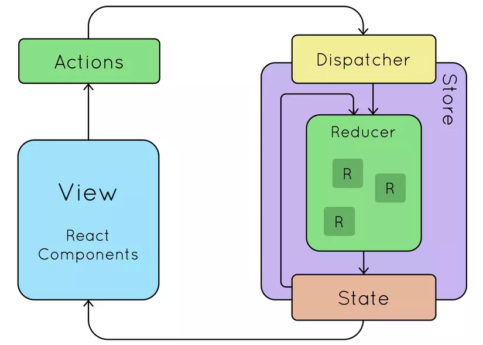
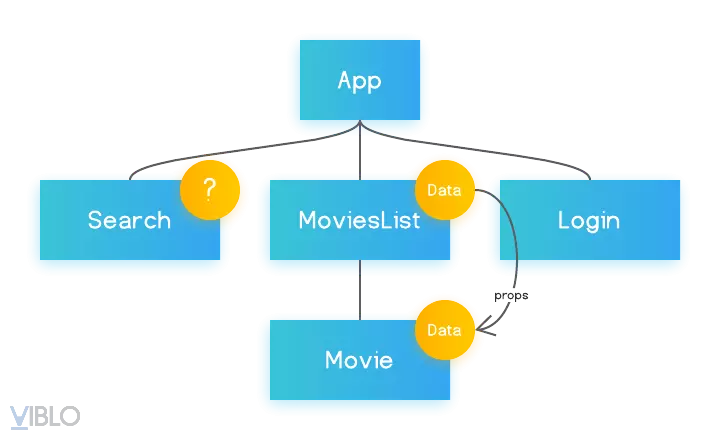

# Buổi 7: React buổi 2

- [Buổi 7: React buổi 2](#buổi-7-react-buổi-2)
  - [Phần 1: Hooks - p2](#phần-1-hooks---p2)
    - [1. useRef](#1-useref)
    - [2. useMemo](#2-usememo)
    - [3. useCallback](#3-usecallback)
    - [4. Quản lý Global State - useContext, useReducer](#4-quản-lý-global-state---usecontext-usereducer)
      - [4.1. Local state vs Global state](#41-local-state-vs-global-state)
      - [4.2. Quản lý Global State:](#42-quản-lý-global-state)
      - [4.3. useContext](#43-usecontext)
      - [4.4. use Reducer](#44-use-reducer)
  - [Phần 2: React Route](#phần-2-react-route)
    - [2.1. Giới thiệu](#21-giới-thiệu)
    - [2.2. Các thành phần cơ bản](#22-các-thành-phần-cơ-bản)
      - [2.2.1. BrowserRouter](#221-browserrouter)
      - [2.2. Routes và Route](#22-routes-và-route)
      - [2.3. Link](#23-link)
      - [2.4. NavLink](#24-navlink)
      - [2.5. Outlet](#25-outlet)
      - [2.6. Navigate](#26-navigate)
    - [2.3. react-router-dom](#23-react-router-dom)
    - [2.4. index route](#24-index-route)
    - [2.5. Dynamic Route](#25-dynamic-route)
    - [2.6. HashRouter (error 404)](#26-hashrouter-error-404)
    - [2.7. Các Hooks của Reacr Router: useParams, useNavigate](#27-các-hooks-của-reacr-router-useparams-usenavigate)
      - [2.7.1 useParams](#271-useparams)
      - [2.7.2. useNavigate](#272-usenavigate)
    - [2.8. Protected Route](#28-protected-route)
    - [2.9. Route Object](#29-route-object)
  - [Phần 3: State management](#phần-3-state-management)
    - [3.1. Zustand](#31-zustand)
      - [3.1.1.Zustand là gì?](#311zustand-là-gì)
      - [3.1.2. Ưu điểm so với Redux](#312-ưu-điểm-so-với-redux)
    - [3.2. Redux](#32-redux)
      - [3.2.1. Redux là gì?](#321-redux-là-gì)
      - [3.2.2. Redux hoạt động như nào?](#322-redux-hoạt-động-như-nào)
        - [3.2.2.1. Actions trong Redux](#3221-actions-trong-redux)
        - [3.2.2.2. Reducer trong Redux](#3222-reducer-trong-redux)
        - [3.2.2.3. Store trong Redux](#3223-store-trong-redux)

## Phần 1: Hooks - p2

### 1. useRef

- `useRef` tạo ra một đối tượng ref với thuộc tính `current` với một giá trị khởi tạo. Đối tượng này tồn tại bền vững xuyên suốt vòng sống của component (không như các biến cục bộ)

```
const refContainer = useRef(initialValue)
```

- Khác với state, đối tượng do `useRef` trả về có thể được sử dụng như 1 biến của lớp, việc thay đổi nó **không làm component re-render**. Thông thường, `useRef` còn được sử dụng chính để tham chiếu tới class component/DOM một cách dễ dàng
- Ví dụ đơn giản nhất về `useRef` là sử dụng nó để focus vào 1 input bất kì:

```jsx
const TextInputWithFocusButton = () => {
  // Khởi tạo ref với giá trị ban đầu là null
  const inputE1 = useRef(null);
  const onButtonClick = () => {
    /*
        Thuộc tính current trỏ tới đối tượng input đã được mount vì thế ta có thể sử dụng các phương thức mặc định của input trong JS
        */
    inputE1.current.focus();
  };

  return (
    <>
      <input ref={inputE1} type="text" />
      <button onClick={onButtonClick}>Focus the input</button>
    </>
  );
};
```

- Hiện tại, `ref`chỉ có thể truy xuất vào class component/DOM. Functional component bản chất không tạo ra instance nào nên không thể truy cập thông qua `ref` được

### 2. useMemo

- Hiểu đơn giản, `useMemo` cho phép ta lưu lại **kết quả tính toán của một hàm** vào bộ nhớ giữa các lần re-render của component và chỉ thay đổi khi các sự phụ thuộc được thay đổi. Điều này có tính tương đồng với `shouldComponentUpdate` trong class component.
- Vì thế, ta có thể sử dụng `useMemo` để ngăn việc thực thi lại hàm mỗi lần component render lại. Điều này có ý nghĩa khi hàm của mình thực hiện các thao tác nặng và tốn tài nguyên
- Ví dụ:

```jsx
const expensiveCalculation = (num) => {
  console.log("Tinh toan lai...");
  return num * 2;
};

function App({ number }) {
  const result = useMemo(() => expensiveCalculation(number), [number]);

  return <div>Ket qua: {result}</div>;
}
```

-> Nếu `number` không đổi thì `expensiveCalculation` không chạy lại.

### 3. useCallback

- giống `useMemo`, nhưng dùng cho **hàm**
- React sẽ trả về cùng một tham chiếu hàm giữa các lần render, nếu dependecies không đổi
- Quan trong khi truyền hàm xuống **component con**, tránh con bị re-render không cần thiết

```jsx
function App() {
  const [count, setCount] = React.useState(0);

  const increment = React.useCallback(() => {
    setCount((c) => c + 1);
  }, []);

  return (
    <div>
      <button onClick={increment}>Tang</button>
      <p>{count}</p>
    </div>
  );
}
```

=> Tổng kết:

- `useRef` -> giữ giá trị hoặc trỏ vào DOM, không gây re-render
- `useMemo` -> nhớ kết quả tính toán (array, object, số, chuỗi)
- `useCallback` -> nhớ hàm để tránh tạo hàm mới mỗi render

### 4. Quản lý Global State - useContext, useReducer

#### 4.1. Local state vs Global state

- Local state: là state thuộc về một component cụ thể, ví dụ trong `SearchBar` ta có:

```jsx
const [keyword, setKeywork] = useState("");
```

-> chỉ SearchBar biết và dùng keyword

- Global state: là state được chia sẻ giữa nhiều component khác nhau trong ứng dụng. Ví dụ: User login - cả Header (hiển thị tên), Sidebar (hiện avatar), và Dashboard (hiện dữ liệu) đều cần biết user là ai. Nếu mỗi component tự quản lý user thì sẽ rối và không đồng bộ -> ta cần 1 nơi quản lý trung tâm

#### 4.2. Quản lý Global State:

- là cách lưu trữ và cập nhật dữ liệu dùng chung cho toàn bộ ứng dụng.
- Giống như mình có một kho trung tâm, các component khác nhau có thể đọc hoặc ghi vào trong kho này, mọi nơi dùng chung state sẽ được cập nhật đồng bộ

#### 4.3. useContext

- Dùng để chia sẻ dữ liệu (state) cho nhiều component mà không cần props drilling (truyền props lòng vòng).
- Giúp tạo Global State đơn giản.
- Ví dụ:

```jsx
import ThemeProvider, { useTheme } from "./ThemeContext";

function App() {
  return (
    <ThemeProvider>
      <Toolbar />
    </ThemeProvider>
  );
}

function Toolbar() {
  const { theme, toggleTheme } = useTheme();
  return (
    <div>
      <p>Theme hiện tại: {theme}</p>
      <button onClick={toggleTheme}>Đổi theme</button>
    </div>
  );
}
```

=> `useContext` thích hợp khi muốn chia sẻ state như: theme, ngôn ngữ, user login.

#### 4.4. use Reducer

- Là hook thay thế cho useState khi state phức tạp hoặc cần quản lý nhiều logic cập nhật.
- Giống Redux thu nhỏ ngay trong component.
- Cú pháp:

```jsx
const [state, dispatch] = useReducer(reducer, initialState);
```

=> Trong đó:

- `reducer` là hàm quyết định state mới dựa vào action.
- `dispatch({ type, payload })` để gửi action.

## Phần 2: React Route

### 2.1. Giới thiệu

- **React Route** là thư viện giúp React có thể điều hướng (routing) giữa nhiều "trang" mà không cần reload lại trình duyệt
- Thay vì mỗi URL lại tải một file HTML mới, React Router chỉ **render component khác nhau dựa vào đường dẫn**
- Ví dụ:
- `/` -> HomePage
- `/about` -> AboutPage
- `/product/123` -> ProductDetailPage

### 2.2. Các thành phần cơ bản

#### 2.2.1. BrowserRouter

- Đây là cái "vỏ bọc" cho toàn bộ app
- Nó giúp React Router quản lý lịch sử URL thông qua `History API` của trình duyệt.
- Mình phải đặt nó ở cấp cao (thường là `index.js` hoặc `main.jsx`)
- Ví dụ:

```jsx
import { BrowserRouter } from "react-router-dom";
import App from "./App";

const root = ReactDom.createRoot(document.getElementById("root"));

root.render(
  <BrowserRouter>
    <App />
  </BrowserRouter>
);
```

#### 2.2. Routes và Route

- `Routes`: chứa toàn bộ định nghĩa đường dẫn
- `Route`: một đường dẫn cụ thể gắn với **component** nào đó

```jsx
import { Routes, Route } from "react-router-dom";

function App() {
  return (
    <Routes>
      <Route path="/" element={<Home />} />
      <Route path="/about" element={<About />} />
    </Routes>
  );
}
```

#### 2.3. Link

- Giống thẻ `<a>` nhưng không reload lại trang
- Dùng để điều hướng nội bộ trong app

```jsx
import { Link } from "react-router- dom";

function Navbar() {
  return (
    <nav>
      <Link to="/">Trang chủ</Link>
      <Link to="/about">Giới thiệu</Link>
    </nav>
  );
}
```

#### 2.4. NavLink

- Giống `Link` nhưng hỗ trợ style khi đang active.
- Rất hay dùng trong menu.
- Ví dụ:

```jsx
import { NavLink } from "react-router-dom";

<NavLink to="/about" className={({ isActive }) => (isActive ? "active" : "")}>
  About
</NavLink>;
```

=> Nếu URL hiện tại là `/about` -> link này sẽ có class `active`

#### 2.5. Outlet

- Dùng để render **route con** bên trong route cha
- Rất quan trong khi làm **nested routes** (lồng nhiều layout)
- Ví dụ:

```jsx
<Route path="/dashboard" element={<DashboardLayout />}>
  <Route path="profile" element={<Profile />} />
  <Route path="setting" element={<Setting />} />
</Route>
```

- Trong **DashboardLayout.js**:

```jsx
import { Layout } from "react-router-dom";

function DashboardLayout() {
  return (
    <div>
      <h2>Dashboard</h2>
      <Outlet /> {/* Nơi render Profile hoặc Settings*/}
    </div>
  );
}
```

#### 2.6. Navigate

- dùng để redirect
- Ví dụ: vào `/old-path` thì tự động chuyển sang `/new-path`
- Ví dụ:

```jsx
import { Navigate } from "react-router-dom";

<Routes>
  <Route path="/old" element={<Navigate to="/new" />} />
</Routes>;
```

- Tổng kết:
  - `BrowserRouter`: cái khung quản lý routing
  - `Routes + Route`: định nghĩa đường dẫn
  - `Link/NavLink`: Bấm chuyển trang không reload
  - `Outlet`: render rout con
  - `Navigate`: chuyển hướng tự động

### 2.3. react-router-dom

- Đây là thư viện chính để dùng React Router trong ứng dụng chạy trên trình duyệt
- Nó mở rộng từ **react-router** (core), thêm những thành phần cụ thể cho môi trường web:

  - `BrowserRouter`, `HashRouter`
  - `Link`, `NavLink`
  - `Routes`, `Route`
  - `Outlet`, `Navigate`
  - các **hook** như `useNavigate`, `useParams`

- **Lưu ý**: nếu chỉ cài `react-router` thì chưa đủ để chạy trên web, vì vậy ta luôn cài:

```bash
npm install react-router-dom
```

### 2.4. index route

- **Khái niệm:** là một route mặc định khi mình truy cập vào một "route cha" mà không có thêm path con nào
- Nó giống như `default child` của một `route`
- Trong React Router v6, thay vì dùng path="/", ta dùng:

```jsx
<Route index element={<Home />} />
```

- **Ví dụ:**

```jsx
<Routes>
  <Route path="/" element={<Layout />}>
    <Route index element={<Home />} />
    <Route path="about" element={<About />} />
    <Route path="contact" element={<Contact />} />
  </Route>
</Routes>
```

=> Giải thích:

- `/` sẽ render `Layout` trước, rồi trong `Outlet` sẽ render `<Home />` (vì `index`)
- `/about` -> render `Layout` + `<About />` trong `Outlet`
- `/contact` -> render `Layout` + `<Contact />`

- Tại sao cần **Index Route**:
  - Nếu không có `index`, khi mình vào `/`, `Layout` vẫn render, nhưng phần `Outlet` trống trơn
  - `index` đảm bảo có một nội dung mặc định khi không match với route con nào

### 2.5. Dynamic Route

- là **route** có **tham số động** trong `path`
- ta khai báo bằng cú pháp `:paraName`
- Dùng khi muốn 1 route xử lý nhiều URL khác nhau nhưng cùng 1 "mẫu"
- Ví dụ:

```jsx
<Routes>
  <Route path="/user/:id" element={<UserDetail />} />
</Routes>
```

- Để lấy giá trị param thì ta dùng hook `useParams` của `react-router-dom`

```jsx
import { useParams } from "react-router-dom";

function UserDetail() {
  const { id } = useParams();
  return <h2>User ID: {id}</h2>;
}
```

- Dynamic route cho nhiều tham số:

```jsx
<Route path="/products/:category/:id" element={<ProductDetail /> /}>
```

- Tại sao cần Dynamic Route:
  - thường dùng cho trang chi tiết (user, sản phẩm, bài viết,...)
  - Tránh phải viết hàng loạt route cứng như `/user/1`, `/user/2`,...

### 2.6. HashRouter (error 404)

- Ngoài `BrowserRouter`, còn có `HashRouter`
- Thay vì dùng "real path" (dạng `/about`), nó sẽ thêm `#` trong URL

- Ví dụ: + `http://localhost:3000/#/about` + `http://localhost:3000/#/contact`
  -> Tức là đường dẫn thực vẫn chỉ là `/`, cong phần sau dấu `#` là để React Router đọc

- Tại sao dùng HashRouter:
  - Khi deploy lên **static hoisting** (như Github Pages, Netlify free, Vercel free), server thường không biết cách xử lý route
  - Nếu dùng `Browser` và gõ trực tiếp `/about`, server sẽ báo **Error 404** (vì server tìm file `/about/index.html` không có)
  - `HashRouter` giải quyết được vấn đề này, vì thật ra URL luôn là `/` và React Router đọc route sau dấu `#`.

```jsx
import { HashRouter, Routes, Route } from "react-router-dom";

function App() {
  return (
    <HashRouter>
      <Routes>
        <Route path="/" element={<Home />} />
        <Route path="/about" element={<About />} />
        <Route path="*" element={<NotFound />} /> {/* Error 404 */}
      </Routes>
    </HashRouter>
  );
}
```

-> Nếu vào `http://localhost:3000/#/abcxyz` → React Router match \* → render `<NotFound />`

### 2.7. Các Hooks của Reacr Router: useParams, useNavigate

#### 2.7.1 useParams

- Dùng để lấy **tham số động** từ URL (gắn với Dynamic Routes)
- Ví dụ

```jsx
import { Routes, Route, useParams } from "react-router-dom";

function ProductDetail() {
  const { id } = useParams(); // lấy param "id"
  return <h2>Chi tiết sản phẩm: {id}</h2>;
}

function App() {
  return (
    <Routes>
      <Route path="/products/:id" element={<ProductDetail />} />
    </Routes>
  );
}
```

- Nếu URL là /products/42 → id = "42".
- Nếu URL là /products/iphone15 → id = "iphone15".
  => useParams luôn trả về một object, key là tên param.

#### 2.7.2. useNavigate

- Dùng để chuyển hướng trang bằng code thay vì dùng `<Link>`
- Ví dụ cơ bản:

```jsx
import { useNavigate } from "react-router-dom";

function Home() {
  const navigate = useNavigate();

  const goToAbout = () => {
    navigate("/about");
  };

  return (
    <div>
      <h2>Home page</h2>
      <button onClick={goToAbout}>Đi tới About</button>
    </div>
  );
}
```

-> Khi bấm nút thì web chuyển sang `/about`

- Điều hướng có tham số:

```jsx
navigate(`/products/${id}`);
```

- Điều hướng lùi hoặc tiến trong history:

```jsx
navigate(-1); //quay lại trang trước
navigate(1); //tiến tới trang sau
```

### 2.8. Protected Route

- là cách **chặn người dùng chưa đăng nhập** (hoặc chưa có quyền) vào một số trang
- Ví dụ: `/dashboard` chỉ cho user đã login, còn nếu chưa login thì redirect về `/login`
- Cách làm Protected Route

  - Cách 1: Tạo component `ProtectedRoute`

```jsx
import { Navigate } from "react-router-dom";

function ProtectedRoute({ children }) {
  const isAuthenticated = localStorage.getItem("token"); // ví dụ check token

  if (!isAuthenticated) {
    // Nếu chưa login thì về trang login
    return <Navigate to="/login" replace />;
  }

  // Nếu login rồi thì render children
  return children;
}

export default ProtectedRoute;
```

    + Cách 2: Sử dụng trong `Routes`

```jsx
import { Routes, Route } from "react-router-dom";
import ProtectedRoute from "./ProtectedRoute";
import Dashboard from "./Dashboard";
import Login from "./Login";

function App() {
  return (
    <Routes>
      <Route path="/login" element={<Login />} />

      <Route
        path="/dashboard"
        element={
          <ProtectedRoute>
            <Dashboard />
          </ProtectedRoute>
        }
      />
    </Routes>
  );
}
```

- Nếu có `token` (đã login) -> vào được `/dashboard`
- Nếu chưa có `token` -> bị `Navigate` về `/login`

### 2.9. Route Object

- Ngoài cách khai báo route bằng JSX `(<Route path="..." element={...} />)`, React Router còn cho phép định nghĩa routes bằng object.
  => Thường dùng khi muốn quản lý route tập trung (config một chỗ).
- Ví dụ với JSX

```jsx
<Routes>
  <Route path="/" element={<Home />} />
  <Route path="/about" element={<About />} />
  <Route path="/products/:id" element={<ProductDetail />} />
</Routes>
```

- Ví dụ với Route Object:

```jsx
import { useRoutes } from "react-router-dom";
import Home from "./Home";
import About from "./About";
import ProductDetail from "./ProductDetail";

const routes = [
  {
    path: "/",
    element: <Home />,
  },
  {
    path: "/about",
    element: <About />,
  },
  {
    path: "/products/:id",
    element: <ProductDetail />,
  },
];

function App() {
  const element = useRoutes(routes); // hook biến routes object thành JSX
  return element;
}

export default App;
```

- Ưu điểm:

  - Dễ quản lý nếu app có nhiều **route phức tạp**
  - Có thể lưu config routes ở file riêng (`route.js`)
  - Dùng tốt khi muốn kết hợp với **ProtectedRoute** hoặc **Layout**

- Tổng kết:
  - JSX: đơn giản, dễ hiểu, dùng nhiều trong tutorial
  - Route Object + useRoutes: chuyên nghiệp hơn, dễ mở rộng với app lớn

## Phần 3: State management

### 3.1. Zustand

#### 3.1.1.Zustand là gì?

- Zustand là một thư viện **state management** trong React. Nó cho phép bạn quản lý trạng thái của ứng dụng của bạn một cách dễ dàng và linh hoạt.
- Zustand là một **state management tool** đơn giản, nó cho phép bạn quản lý trạng thái dễ dàng bằng cách sử dụng hook và store.
- Zustand không yêu cầu bạn sử dụng bất kỳ concept hay hoạt động phức tạp nào để quản lý trạng thái.
- Với Zustand, bạn có thể **tạo một store** với giá trị ban đầu, và sau đó có thể truy cập hoặc cập nhật trạng thái từ bất kỳ component nào trong ứng dụng của bạn. Zustand cung cấp một số hook như useStore hoặc useState để truy cập và cập nhật trạng thái.

#### 3.1.2. Ưu điểm so với Redux

- Cấu trúc đơn giản, dễ dàng implement và sử dụng.
  Zustand chỉ re-render lại component khi có sự thay đổi state.
- Zustand quản lý state tập trung ở một chỗ, điểm này tương đồng với Redux, nhưng khác với Redux phải tạo action, reducer và dispatch action để handle thay đổi state thì Zustand lại làm nó một cách dễ dàng hơn, chỉ cần store là đủ.
- Sử dụng hooks để tạo store, phù hợp với cấu trúc dự án sử dụng Hooks ở hiện tại.
- Clean code, ngắn gọn trong cách triển khai và dễ đọc code.
- Ví dụ tạo một store để quản lý trạng thái người dùng:

```jsx
// App.js
import { create } from "zustand";

const nameStore = create((set) => ({
  name: "",
  updateName: (value) => set((state) => ({ ...state, name: value })),
}));

const App = () => {
  const { name, updateName } = nameStore();

  const [inputValue, setInputValue] = useState("");

  const handleSubmit = () => {
    updateName(inputValue);
    setInputValue("");
  };

  return (
    <>
      <TextInput
        placeholder="Enter name here"
        value={inputValue}
        onChangeText={(value) => setInputValue(value)}
      />
      <Button title="Submit" onPress={handleSubmit} />
      <Text>{name}</Text>
    </>
  );
};

export default App;
```

### 3.2. Redux



- Vấn đề: Tưởng tượng bạn đang viết một ứng dụng quản lý phim có tính năng đăng nhập và xem danh sách các phim. Các component được tổ chức như sau:
  - **MoviesList**: Hiển thị danh sách các phim, bao gồm 1 list các component Movie
  - **Movie**: là 1 item trong MoviesList, hiển thị thông tin một phim
  - **Login**: chức năng đăng nhập


- Ta có **data** là danh sách thông tin các phim, khi đó data được chuyển đổi qua lại giữa các component trong ứng dụng như thế nào? Theo kiến thức cơ bản đã được học, ta có thể để data là state trong MoviesList, rồi truyền data xuống component Movie dưới dạng props:


- Cách này ổn cho đến khi ta thêm 1 component mới, ví dụ như **Search**, để search các phim, và nó cũng sử dụng data. Vì là 1 component riêng, ta **không** thể truyền data từ component MovieList sang bằng props được:



- Lúc này ta buộc phải đưa data lên component ở trên nữa là **App** mới có thể truyền data xuống **Search component**. Dễ thấy theo mô hình này, khi ứng dụng mở rộng thêm các loại data khác, tất cả sẽ được đưa vào App và các hàm xử lý data cũng phải định nghĩa ở App, khiến App component trở nên khổng lồ với vô vàn trách nhiệm. Bad design!


- Giải pháp: Với Redux, ta đưa tất cả data, các state vào 1 nơi gọi là **store**, khi component nào cần dùng hoặc thay đổi data, nó sẽ lấy hoặc cập nhật data ở **store**. Các data trong các component là thống nhất với nhau vì **store** là toàn cục trong toàn bộ App.


#### 3.2.1. Redux là gì?

- Nói một cách đơn giản, Redux là một công cụ quản lý trạng thái. Mặc dù nó được sử dụng chủ yếu với React, nhưng nó có thể được sử dụng với bất kỳ khung hoặc thư viện JavaScript nào khác. Nó rất nhẹ ở mức 2KB (bao gồm cả phụ thuộc), vì vậy bạn không phải lo lắng về việc nó làm cho ứng dụng của bạn có kích thước lớn.

- Với Redux, trạng thái ứng dụng của bạn được giữ trong một "store" và mỗi thành phần có thể truy cập bất kỳ trạng thái nào mà nó cần từ "store"này. Sâu hơn một chút để xem tại sao bạn có thể cần một công cụ quản lý trạng thái.

#### 3.2.2. Redux hoạt động như nào?

- Cách Redux hoạt động rất đơn giản. Có một **"store"** trung tâm chứa toàn bộ trạng thái của ứng dụng. Mỗi thành phần có thể truy cập trạng thái được lưu trữ mà không phải gửi từ thành phần này sang thành phần khác.
- Có **ba phần** xây dựng: **actions, store, and reducers**. Hãy nói ngắn gọn về cách hoạt động của từng loại. Điều này rất quan trọng vì chúng giúp chúng ta hiểu được lợi ích của Redux và cách sử dụng nó.

##### 3.2.2.1. Actions trong Redux

- Nói một cách đơn giản, **action** là sự kiện. Chúng là **cách duy nhất** bạn có thể gửi dữ liệu từ ứng dụng của mình đến "store" Redux. Dữ liệu có thể là từ các tương tác của người dùng, các lệnh gọi API hoặc là gửi form.
- Các hành động được gửi bằng phương thức `store.dispatch()`. Các hành động là các đối tượng JavaScript đơn giản và chúng phải có thuộc tính loại để chỉ ra loại hành động sẽ được thực hiện. Họ cũng phải có một "payload" có chứa thông tin cần được xử lý bằng hành động. Hành động được tạo thông qua Action Creator.
- Ví dụ về hành động có thể được thực hiện trong quá tình đăng nhập ứng dụng:

```jsx
{
    type: "LOGIN",
    payload: {
        username: "foo",
        password: "bar"
    }
}
```

- Ví dụ về Action Creator:

```jsx
const setLoginStatus = (name, password) => {
  return {
    type: "LOGIN",
    payload: {
      username: "foo",
      password: "bar",
    },
  };
};
```

=> action phải chứa thuộc tính và sau đó thành phần khác sẽ được "payload" lưu trữ.

##### 3.2.2.2. Reducer trong Redux

- **Reducers** là các hàm thuần túy **lấy trạng thái hiện tại** của ứng dụng, **thực hiện một hành động và trả về trạng thái mới**. Các trạng thái này được **lưu trữ dưới dạng đối tượng** và chúng xác định trạng thái của ứng dụng thay đổi như thế nào để đáp ứng với hành động được gửi đến "store".
- Nó dựa trên hàm "reduce" trong JavaScript, trong đó một giá trị được tính từ nhiều giá trị sau khi thực hiện chức năng gọi lại.
- Ví dụ:

```jsx
const LoginComponent = (state = initialState, action) => {
  switch (action.type) {
    // This reducer handles any action with type "LOGIN"
    case "LOGIN":
      return state.map((user) => {
        if (user.username !== action.username) {
          return user;
        }

        if (user.password == action.password) {
          return {
            ...user,
            login_status: "LOGGED IN",
          };
        }
      });
    default:
      return state;
  }
};
```

`=> Reducers lấy trạng thái trước của ứng dụng và trả về trạng thái mới dựa trên hành động được truyền cho nó.`

- Vì là các hàm thuần túy, chúng không thay đổi dữ liệu trong đối tượng được truyền cho chúng hoặc thực hiện bất kỳ tác dụng phụ nào trong ứng dụng. Cho cùng một đối tượng, chúng phải luôn tạo ra cùng một kết quả.

##### 3.2.2.3. Store trong Redux

- Các "store" giữ trạng thái ứng dụng. Chỉ có một "store" trong bất kỳ ứng dụng Redux nào. Bạn có thể truy cập trạng thái được lưu trữ, cập nhật trạng thái và đăng ký hoặc hủy đăng ký "listeners" thông qua các phương thức trợ giúp.
- Tạo store cho việc đăng nhập:

```jsx
const store = createStore(LoginComponent);
```

- Các hành động được thực hiện trên trạng thái luôn trả về một trạng thái mới. Vì vậy, quản lý trạng thái là rất dễ dàng và có thể dự đoán.

Bây giờ chúng ta đã biết thêm một chút về Redux, hãy quay lại ví dụ thành phần đăng nhập đã được triển khai trước đó và xem Redux có thể cải thiện thành phần như thế nào.

```jsx
class App extends React.Component {
  render() {
    return (
      <div>
        <Status user={this.props.user.name} />
        <Login login={this.props.setLoginStatus} />
      </div>
    );
  }
}
```

- Với Redux, có một trạng thái chung trong store và mỗi thành phần có quyền truy cập vào trạng thái. Điều này giúp loại bỏ sự cần thiết phải liên tục chuyển trạng thái từ thành phần này sang thành phần khác.
